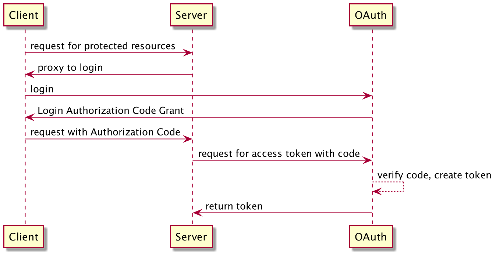

# Security Tests

## Contents
  * Overview
  * How is it implemented?
  * Test Automation
  
## Overview 
### Security Tests 
Security technology includes a large set of APIs, tools, and implementations of commonly used security algorithms, mechanisms, and protocols.

The test.security package contains simple tests which are designed to exercise the common pattern and domains of java security。

Here is a broad overview of test materials.
 
#### Secure Communication
Test the data that travels across a network can not be accessed by someone who is not the intended recipient, and test various combinations of cryptography and application protocols work together.

 
##### OAuth
An Application using 'Authorization Code Grant', which contains 
- a Client(performs a login)
- Server(Proxy login to Auth Center) 
- Auth Center(authenticate user login)

- User Story
> Assume server is an small application needs to read data from github, and github access requires a token to use its public API.
> Normally, users won't trust the 3rd party application with their account and password, so we need to redirect user to the github login website
and callback to app with login token.

> But still, the token is very important and should not be transported via plain text, so we introduce an Authorization Code and let the application backend request the token with specific app secret.

- But the Authorization Code is still text, what if someone try to get a token via that code?
> OAuth center must verify code and app secret to ensure only the application could get token.

- Is this a common usage?
> Authorization Code Grant 
> https://www.oauth.com/oauth2-servers/server-side-apps/authorization-code/
   
##### SSL/TLS
Test the following built-in provider that implements the SSL/TLS protocols:
- SSLv3
- TLSv1
- TLSv1.1
- TLSv1.2
- TLSv1.3

## How is it implemented?
Both Lambda and Streams tests are implemented as self contained JUnit tests. These tests are invoked via the STF load test framework. 
 
## Test Automation
These tests are only run as part of the STF load testing framework stf.load. You can find the load tests which are defined to use these test.lambda API tests, such as LambdaLoadTest.java, within the openjdk.test.load package.